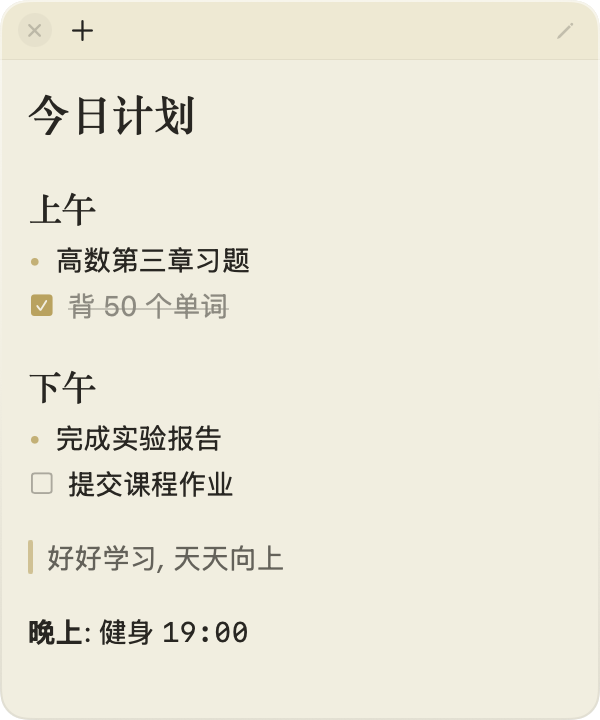
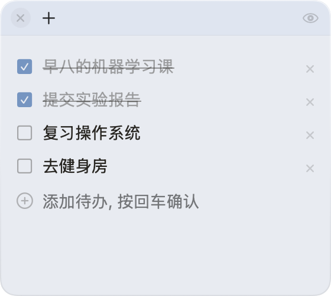
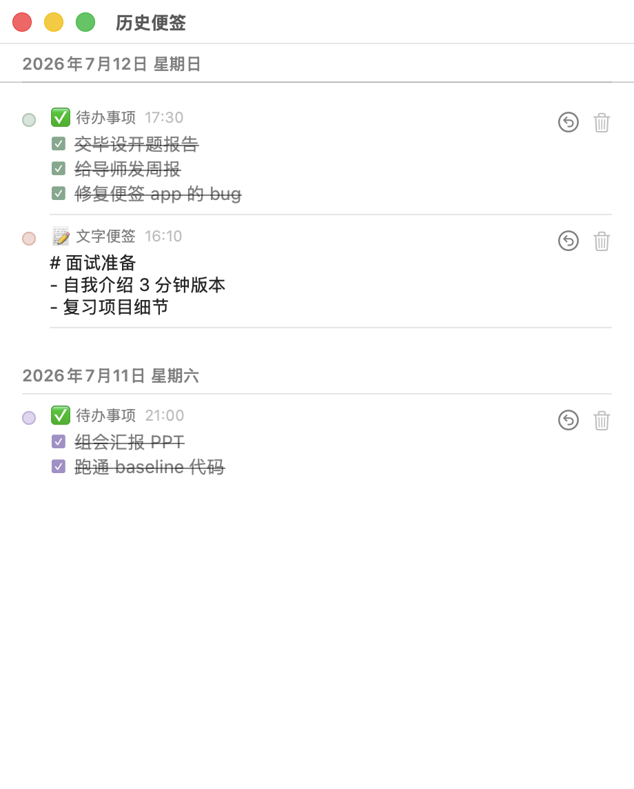

# StickyNotes 📝

[中文](README.md) | **English**

A lightweight, beautiful sticky notes app for macOS. Built with native Swift + SwiftUI, zero third-party dependencies — the compiled binary is only a few hundred KB.

## Screenshots

<table>
  <tr>
    <td align="center"><b>📝 Text Notes</b><br><sub>Markdown rendering · Glassmorphism</sub></td>
    <td align="center"><b>✅ Todo Notes</b><br><sub>Check to strike through</sub></td>
  </tr>
  <tr>
    <td></td>
    <td></td>
  </tr>
</table>

<b>🕰 History</b> — deleted notes are archived by date, so you can look back at what you did each day and restore any note with one click<br>


<br><b>📏 Collapsed Notes + Edge Snapping</b> — collapse a note into a single title bar (todo notes show completion progress);
drag it near the left/right screen edge to snap flush, with the edge-side corners "cut flat"; release to settle smoothly with trackpad haptic feedback<br>
<br>
<br>


## Features

- **Two note types**
  - 📝 **Text notes**: Markdown support (headings, lists, todo syntax, quotes, bold/italic/inline code, dividers), one-click toggle between edit and preview
  - ✅ **Todo notes**: add items one by one, check the box to strike through, edit or delete individual items
- **Three window modes** (set per note)
  - 📌 Always on top — floats above every other window
  - 🪟 Normal window — behaves like a regular app
  - 🖥 Pinned to desktop — sinks to the desktop layer, sticking to the wallpaper like a widget without blocking anything
- **History**: deleted notes are automatically archived by date; browse day by day and restore with one click
- **Collapsed notes**: collapse a note into a single title bar — the title comes from the first line and is never truncated; todo notes show completion progress (e.g. `2/4`); collapsed state persists across restarts
- **Edge snapping**: drag a collapsed bar near the left/right screen edge to snap flush — the edge-side corners turn square (as if "cut off" by the screen), with trackpad haptic feedback; release to settle smoothly
- **Checkable preview**: in text-note preview mode, the checkboxes rendered from `- [ ]` are directly clickable, and the source text stays in sync
- **AI integration (MCP)**: built-in MCP server so AI assistants like Codex / Claude can create, modify, and read notes directly (see below)
- **Five soft colors**: Morandi-style lemon yellow / peach pink / mint green / sky blue / lilac purple
- **Glassmorphism design**: frosted translucent background, gradient glass border, serif headings
- **Auto save**: writes to disk 1 second after you stop typing; position, size, color, and mode are all remembered
- **Launch at login**: one-click toggle in the menu bar
- **Unobtrusive**: no Dock icon — lives quietly in the menu bar; borderless rounded-card design

## Install

Requires macOS 14+ and Xcode Command Line Tools (`xcode-select --install`).

```bash
git clone git@github.com:simony3/StickyNotes.git
cd StickyNotes
./build.sh
open /Applications/StickyNotes.app
```

`build.sh` compiles, packages the `.app`, signs it (ad-hoc), and installs it to `/Applications`.

## Usage

| Action | How |
|---|---|
| New note | Menu bar 📝 icon, or **+** in a note's top bar (both let you pick the type) |
| Move | Drag anywhere on the note |
| Resize | Drag the note's edges |
| Change color / window mode | Hover over the note's top bar |
| Edit / preview | ✏️ / 👁 button in the top bar |
| Collapse / expand | Collapse button at the far right of the top bar |
| Edge snap | Drag a collapsed bar near the left/right screen edge (snaps within 16pt, drag away to release) |
| Check off todos | Click the checkbox in a todo note; clicking `- [ ]` boxes in text-note preview works too |
| Delete note | ✕ at the top left (archived into history, recoverable) |
| View / restore history | Menu bar → "History" |
| Summon all notes | Click the app icon |

### Markdown cheat sheet (text notes)

```markdown
# H1   ## H2   ### H3
- bullet list
- [ ] todo   - [x] done
> quote
**bold** *italic* `code`
---
```

## AI Integration (MCP)

The project ships a zero-dependency [MCP](https://modelcontextprotocol.io/) server (`mcp/stickynotes_mcp.py`, runs on the system Python) that exposes sticky-note capabilities to any MCP-compatible AI client (Codex, Claude Desktop, Claude Code, etc.). Once configured, just tell your AI "put tomorrow's study plan on a sticky note" and it appears on screen.

**Available tools:**

| Tool | Description |
|---|---|
| `create_note` | Create a note (full parameters: type / color / window mode / collapsed, etc.) |
| `update_note` | Modify an existing note's content or color (by id) |
| `list_notes` | Read all current notes |
| `list_history` | Read the history archive |
| `overwrite_data` | Catch-all tool: rewrite the entire note data (auto backup + app restart); deletion, mode changes, history restore, and everything else fall back to it |

**Setup (Codex desktop)** — append to `~/.codex/config.toml`:

```toml
[mcp_servers.stickynotes]
command = "python3"
args = ["/path/to/StickyNotes/mcp/stickynotes_mcp.py"]
```

**Setup (Claude Code):**

```bash
claude mcp add stickynotes -- python3 /path/to/StickyNotes/mcp/stickynotes_mcp.py
```

Restart the client and the AI will see the tools above.

## Data Storage

Notes are saved to `~/Library/Application Support/StickyNotes/notes.json` as plain JSON, easy to back up and migrate.

## Project Structure

```
Sources/StickyNotes/
├── main.swift          # Entry point, NSApplication startup, hidden Edit menu (keyboard shortcuts)
├── AppDelegate.swift   # Menu bar, note window management, type picker, URL interface
├── Note.swift          # Data model + JSON persistence + todo item I/O + history archiving
├── NoteView.swift      # SwiftUI views: note view, todo list, Markdown rendering, capsule bar
├── HistoryView.swift   # History window: grouped by date, restore, permanent delete
└── NoteWindow.swift    # Borderless window, three layer modes, collapse & edge snapping
mcp/
└── stickynotes_mcp.py  # MCP server: entry point for AI clients to control notes
```

## License

[MIT](LICENSE)
